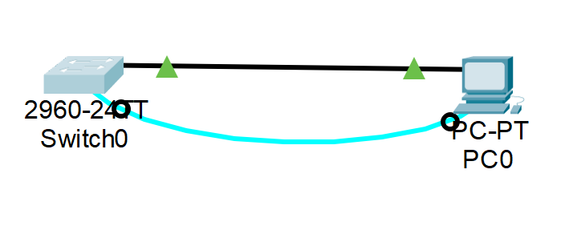

#  Базовая настройка коммутатора

###  Задание:

  1. Проверка конфигурации коммутатора по умолчанию;
  2. Создание сети и настройка основных параметров устройства;  
    1. Настройте базовые параметры коммутатора.  
    2. Настройте IP-адрес для ПК  
  3. Проверка сетевых подключений  
    1. Отобразите конфигурацию устройства.  
    2. Протестируйте сквозное соединение, отправив эхо-запрос.  
    3. Протестируйте возможности удаленного управления с    помощью Telnet  
  

###  Дано:
#### Таблица адресации:
| Устройство    | Интерфейс    | IP-адресс          |
|--------------:|:-------------|-------------------:|
| S1            | Vlan 1       | 192.168.1.2        | 
|               |              | 255.255.255.0      | 
| PC-A          | NIC          | 192.168.1.10       | 
|               |              | 255.255.255.0      | 

#### Топология:
  

###  Решение:
 
###  1. Проверка конфигурации коммутатора по умолчанию.
  1.1. Подключаемся через консоль, и вводим команды
    enable
    show running-config
    1. [Получим результат;][def]  
     . FastEthernet - 24 интерфейса.  
     . GiGigabitEthernet - 2 интерфейса  
     . от 0 до 15, то есть всего 16 VTY-линий. (но пока не будет задан пасворд подклчение не работает)    
     . Сообщение "startup-config is not present" появляется потому, что загрузочная конфигурация (startup-config) не была сохранена в NVRAM.  
     . IP На VLAN 1 не назначен, интерфейс выключен, MAC address is 000a.f30a.8cd5  
     . show ip interface vlan 1
     Vlan1 is administratively down, line protocol is down
       "Internet protocol processing disabled"  
     . Интерфейс VLAN 1 остаётся без IP-адреса и выключенным (administratively down), поэтому подключение PC-A к порту F0/6 не влияет на его IP-свойства — SVI VLAN 1 по-прежнему неактивен.  
     . Версия model(WS-C2960-24TT-L)  Version(15.0(2)SE4)          Image(C2960-LANBASEK9-M)  
     . show interface f0/6, линк up т.к. кабель подключен. Чтоб включить интерфейс надо выполнить "no shotdown". MAC " 0001.6412.b006". Скорость: 100 Мбит/с, Дуплекс: Full-duplex.  
     . Имя образа Cisco IOS: 2960-lanbasek9-mz.150-2.SE4.bin.  

[def]: conf/base_conf.md  
 
###  2. Создание сети и настройка основных параметров устройства;  
  1. Настройте базовые параметры коммутатора.  
   . enable  
     configure  
     interface vlan 1  
     ip address 192.168.1.2 255.255.255.0  
  2. Настройте IP-адрес для ПК.  
   . 192.168.1.10 255.255.255.0  
###  3. Проверка сетевых подключений;  
  1. [отобразите конфигурацию устройства;][def1]  

[def1]: conf/base_conf2.md  