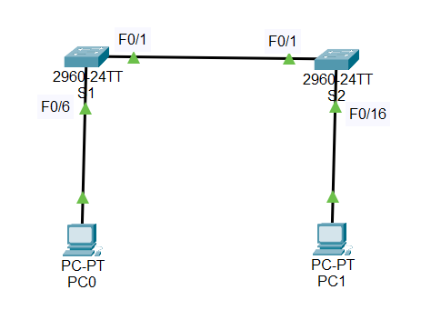

#  Базовая настройка коммутатора

###  Задание:
 1. Создание и настройка сети
 2. Изучение таблицы МАС-адресов коммутатора

  
  

###  Дано:
#### Таблица адресации:
| Устройство  | Интерфейс   | IP-адресс      | Маска подсети |
|------------:|:------------|---------------:|--------------:|
| S1          | Vlan 1      | 192.168.1.11   | 255.255.255.0 |
| S2          | Vlan 1      | 192.168.1.12   | 255.255.255.0 |
| PC-A        | NIC         | 192.168.1.1    | 255.255.255.0 |
| PC-B        | NIC         | 192.168.1.2    | 255.255.255.0 |

#### Топология:
  

###  Решение:
 
###  1. Проверка конфигурации коммутатора по умолчанию.
  1. Подключаем cесть настрайваем каждый коммутатор
     
  2. 
     [Получим результат устройство S1;][def]  
     [Получим результат устройство S2;][def1] 
     [Получим результат устройство PC-A;][def2] 
     [Получим результат устройство PC-B;][def3] 
 
###  2. Создание сети и настройка основных параметров устройства;  
  1. Настройте базовые параметры коммутатора.  
   * enable  
     configure  
     interface vlan 1  
     ip address 192.168.1.2 255.255.255.0  
  2. Настройте IP-адрес для ПК.  
   * 192.168.1.10 255.255.255.0  
###  3. Проверка сетевых подключений;  
  1. [отобразите конфигурацию устройства;][def1]  
  2. Протестируйте сквозное соединение, отправив эхо-запрос.  
       
  3. Протестируйте возможности удаленного управления с помощью Telnet.  
        

[def]: conf/s1.md 
[def1]: conf/s2.md  
[def2]: conf/pca.md  
[def3]: conf/pcb.md