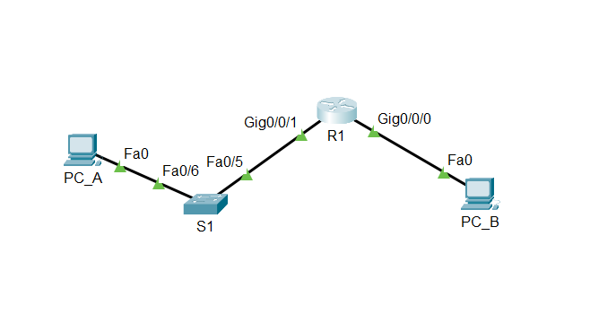
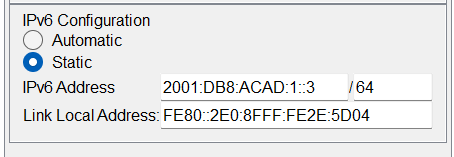
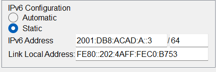
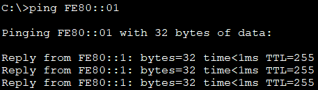
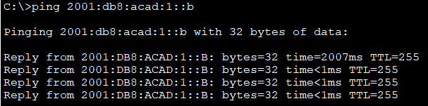
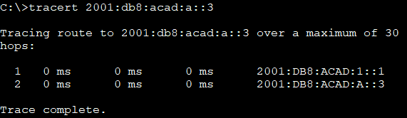
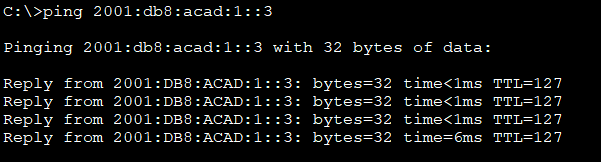
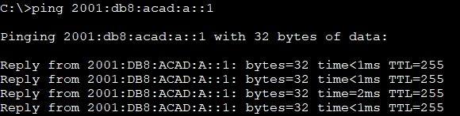

#  Настройка IPv6-адресов на сетевых устройствах 

###  Задание:

  1. Настройка топологии и конфигурация основных параметров маршрутизатора и коммутатора
  2. Ручная настройка IPv6-адресов  
  3. Проверка сквозного соединения  
    
  
###  Дано:
#### Таблица адресации:
| Устройство   | Интерфейс| IP-адресс          |Link local IPv6-адрес|Длина префикса|gateway|  
|-------------:|:---------|:-------------------|:--------------------|:-------------|:------|  
| R1           | G0/0/0   | 2001:db8:acad:a::1 | fe80::1             | 64           |  -    |   
|              | G0/0/1   | 2001:db8:acad:1::1 | fe80::1             | 64           |  -    |  
| S1           | VLAN 1   | 2001:db8:acad:1::b | fe80::b             | 64           |  -    |  
| PC-A         | NIC      | 2001:db8:acad:1::3 | SLACC               | 64           |fe80::1|  
| PC-B         | NIC      | 2001:db8:acad:a::3 | SLACC               | 64           |fe80::1|  
  
#### Топология:  
    
  
###  Решение:  
 
###  1. Настройка топологии и конфигурация основных параметров маршрутизатора и коммутатора.
  1. Настрайваем коммутатор S1  
    [Получим результат;][def] 
      
  2. Настрайваем Маршрутизатор R1  
    [Получим результат;][def1]  
  3. Настрайваем PC_A  
      
  4. Настрайваем PC_B  
      
    
 
 
###  2. Ручная настройка IPv6-адресов;  
  1. Назначение IPv6-адреса интерфейсам Ethernet на R1  
    1. R1#show ipv6 interface brief   
          GigabitEthernet0/0/0 [up/up]  
          FE80::1  
          2001:DB8:ACAD:A::1  
          GigabitEthernet0/0/1 [up/up]  
          FE80::1  
          2001:DB8:ACAD:1::1  
          Vlan1 [administratively down/down]  
          Unassigned  
    2. R1#show ipv6 interface gigabitEthernet 0/0/0  
          GigabitEthernet0/0/0 is up, line protocol is up  
          IPv6 is enabled, link-local address is FE80::1  
          No Virtual link-local address(es):  
          Global unicast address(es):  
            2001:DB8:ACAD:A::1, subnet is 2001:DB8:ACAD:A::/64  
          Joined group address(es):  
            FF02::1  
            FF02::2  
            FF02::1:FF00:1  
          MTU is 1500 bytes  
          ICMP error messages limited to one every 100 milliseconds  
          ICMP redirects are enabled  
          ICMP unreachables are sent  
          ND DAD is enabled, number of DAD attempts: 1  
          ND reachable time is 30000 milliseconds  
          ND advertised reachable time is 0 (unspecified)  
          ND advertised retransmit interval is 0 (unspecified)  
          ND router advertisements are sent every 200 seconds  
          ND router advertisements live for 1800 seconds  
          ND advertised default router preference is Medium  
          Hosts use stateless autoconfig for addresses.  
      * Группы многоадресной рассылки, назначенные интерфейсу GigabitEthernet0/0/0:  
        FF02::1 — все узлы в локальном канальном сегменте.  
        FF02::2 — все маршрутизаторы в локальном канальном сегменте.  
        FF02::1:FF00:1 — адрес соликитации, соответствующий глобальному   
  2. Активация IPv6-маршрутизаций на R1.    
    1.  R1(config)#ipv6 unicast-routing   
    2.  C:\>ipconfig  
        FastEthernet0 Connection:(default port)  
  
        Connection-specific DNS Suffix..:   
        Link-local IPv6 Address.........: FE80::202:4AFF:FEC0:B753  
        IPv6 Address....................: 2001:DB8:ACAD:A::3  
        IPv4 Address....................: 0.0.0.0  
        Subnet Mask.....................: 0.0.0.0  
        Default Gateway.................: FE80::1  
    3. Почему PC-B получил глобальный префикс маршрутизации и идентификатор подсети, которые вы настроили на R1?  
     * Потому что после включения ipv6 unicast-routing маршрутизатор R1 начал отправлять Router Advertisement с префиксом 2001:DB8:ACAD:A::/64, и PC-B использовал SLAAC, чтобы сформировать свой глобальный адрес и назначить шлюз по умолчанию.  
  3. Назначение IPv6-адреса интерфейсу управления (SVI) на S1.  
    * S1#show ipv6 interface vlan 1  
      Vlan1 is up, line protocol is up  
        IPv6 is enabled, link-local address is FE80::B  
        No Virtual link-local address(es):  
        Global unicast address(es):  
          2001:DB8:ACAD:1::B, subnet is 2001:DB8:ACAD:1::/64  
        Joined group address(es):  
          FF02::1  
          FF02::1:FF00:B  
        MTU is 1500 bytes  
        ICMP error messages limited to one every 100 milliseconds  
        ICMP redirects are enabled  
        ICMP unreachables are sent  
        Output features: Check hwidb  
        ND DAD is enabled, number of DAD attempts: 1  
        ND reachable time is 30000 milliseconds  
      S1#  
  4. Назначение компьютерам статические IPv6-адреса.  
     * Настрайваем PC_A  
         
     * Настрайваем PC_B  
         

###  3. Часть 3. Проверка сквозного подключения;  
  1. Эхо-запрос PC-A > FE80::1    
       
  2. Эхо-запрос PC-A > FE80::1    
       
  3. tracert PC-A > PC-B    
       
  4. Эхо-запрос PC-B > PC-A    
       
  5. Эхо-запрос PC-B > R1 G0/0    
       

### 4. Вопросы.  
  1. Почему обоим интерфейсам Ethernet на R1 можно назначить один и тот же локальный адрес канала — FE80::1?  
    *  Link-local адреса действуют только в пределах одного сегмента. Они не маршрутизируются за пределы этого сегмента.  
  2. Какой идентификатор подсети в индивидуальном IPv6-адресе 2001:db8:acad::aaaa:1234/64? 
    * Идентификатор подсети — это 0000 (или 0).  
      Полный префикс сети: 2001:0db8:acad:0000::/64  

[def]: conf/base_conf.md 
[def1]: conf/base_conf2.md  