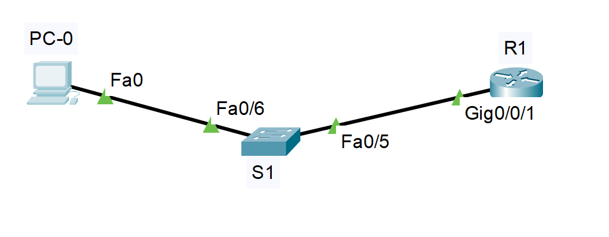
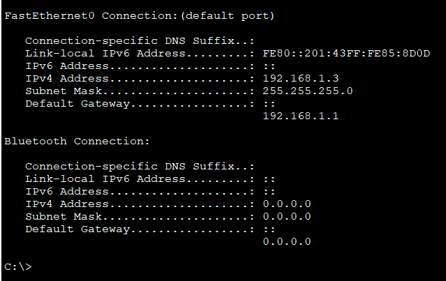
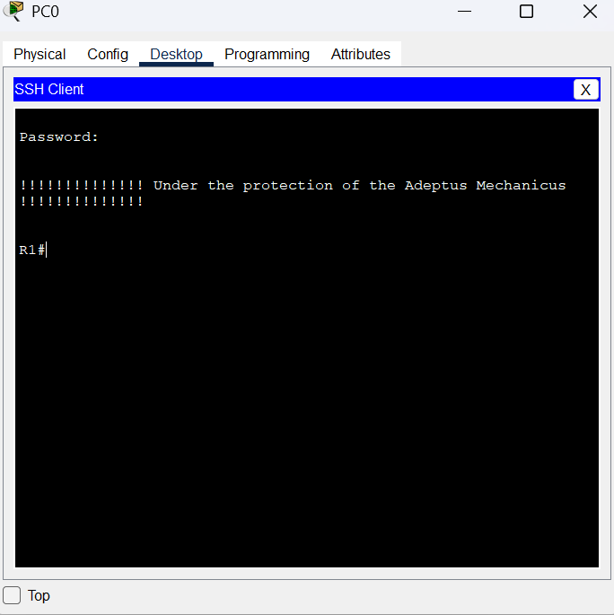
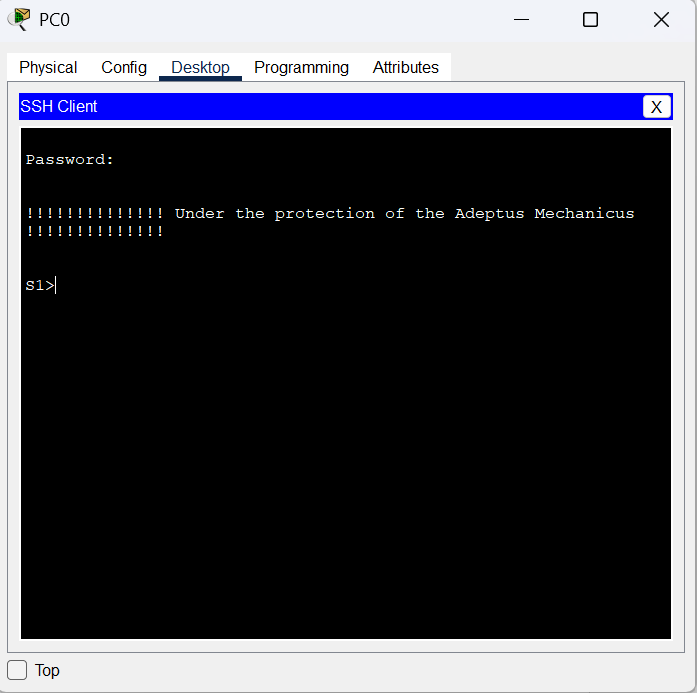
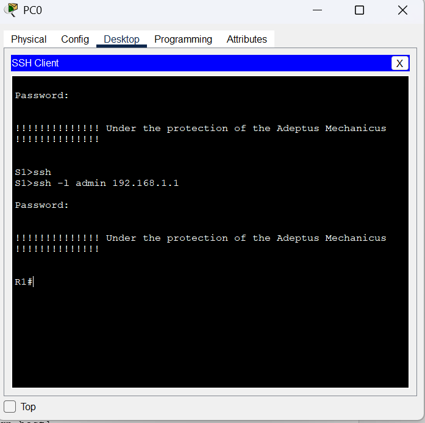

#  Доступ к сетевым устройствам по протоколу SSH  

###  Задание:

 1. Настройка основных параметров устройства
 2. Настройка маршрутизатора для доступа по протоколу SSH
 3. Настройка коммутатора для доступа по протоколу SSH
 4. SSH через интерфейс командной строки (CLI) коммутатора
 
    
  
###  Дано:
#### Таблица адресации:
| Устройство   | Интерфейс| IP-адресс    |Маска подсети     | gateway         |  
|-------------:|:---------|:-------------|:-----------------|:----------------|  
| R1           | G0/0/1   | 192.168.1.1  | 255.255.255.0    |  ------------   |      
| S1           | VLAN 1   | 192.168.1.11 | 255.255.255.0    |  192.168.1.1    |       
| PC-A         | NIC      | 192.168.1.13 | 255.255.255.0    |  192.168.1.1    |   
#### Топология:  
    
  
###  Решение:  
 
###  1. Настройка основных параметров устройств;
  1. Настрайваем коммутатор S1  
    [Получим результат;][def] 
      
  2. Настрайваем Маршрутизатор R1  
    [Получим результат;][def1]  
      
  3. Настрайваем PC_0  
      
    
 
 
###  2. Часть 2. Настройка маршрутизатора для доступа по протоколу SSH;  
  1. Настрайваем устройств. 
   
  2.  Установите соединение с маршрутизатором по протоколу SSH.    
       
    
    
###  3. Настройка коммутатора для доступа по протоколу SSH;  
  1. Настрайваем устройств. 
   
  2.  Установите соединение с маршрутизатором по протоколу SSH.    
       
    
### 4. Настройка протокола SSH с использованием интерфейса командной строки (CLI) коммутатора.  
  1.  Установите соединение с маршрутизатором по протоколу SSH.    
        
  
### 5. Вопросы;  
  1. Как предоставить доступ к сетевому устройству нескольким пользователям, у каждого из которых есть собственное имя пользователя?    
    1.1. Создать пользователей с разными уровнями привилегий, и натсроить VTY-линии.  
    1.2. Через RADIUS или TACACS+, для круаных сетей и большого количества пользователей.  

[def]: conf/base_conf.md 
[def1]: conf/base_conf2.md  