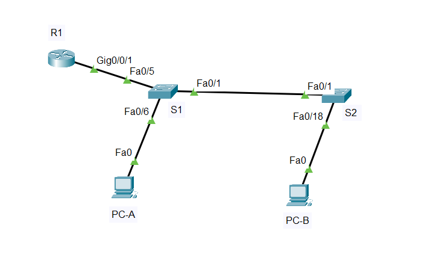
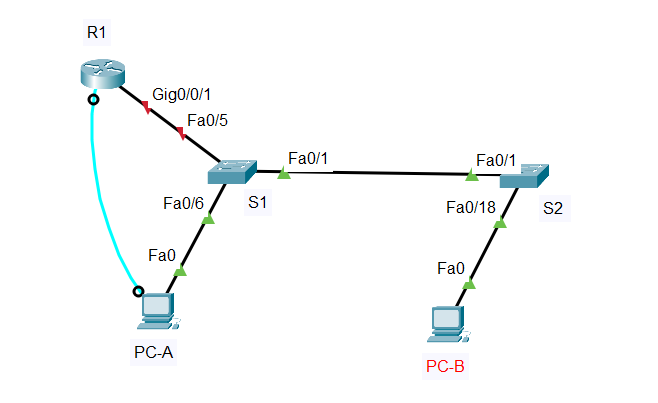
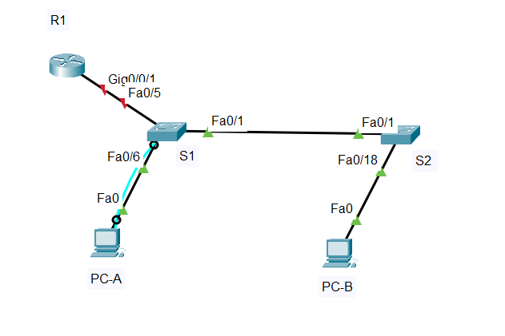
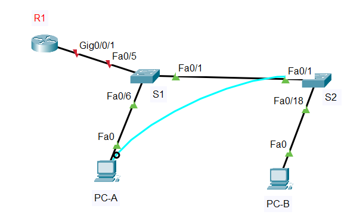
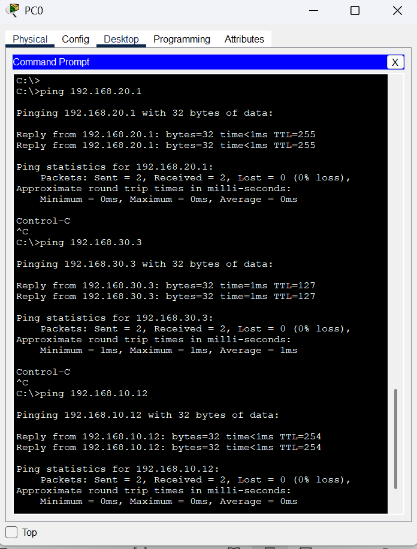
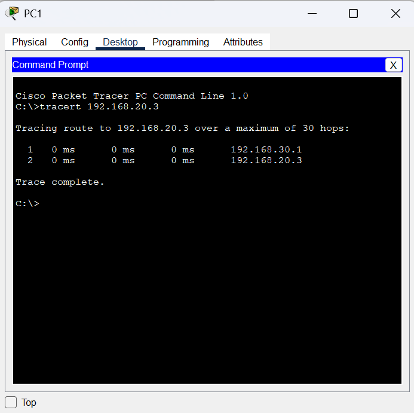

#  Лабораторная работа - Внедрение маршрутизации между виртуальными локальными сетями   

###  Задание:

 1. Создание сети и настройка основных параметров устройства
 2. Создание сетей VLAN и назначение портов коммутатора
 3. Настройка транка 802.1Q между коммутаторами.
 4. Настройка маршрутизации между сетями VLAN
 5. Проверка, что маршрутизация между VLAN работает

 
    
  
###  Дано:
#### Таблица адресации:
| Устройство   | Интерфейс   | IP-адресс     |Маска подсети     | gateway          |  
|-------------:|:------------|:--------------|:-----------------|:-----------------|  
| R1           | G0/0/1.10   | 192.168.10.1  | 255.255.255.0    |  ------------    |      
|              | G0/0/1.10   | 192.168.20.1  | 255.255.255.0    |  ------------    |      
|              | G0/0/1.10   | 192.168.30.1  | 255.255.255.0    |  ------------    |     
|              | G0/0/1.1000 | ------------  | ------------     |  ------------    |      
| S1           | VLAN 10     | 192.168.10.11 | 255.255.255.0    |  192.168.10.1    |       
| S2           | VLAN 10     | 192.168.10.12 | 255.255.255.0    |  192.168.10.1    |       
| PC-A         | NIC         | 192.168.20.3  | 255.255.255.0    |  192.168.20.1    |   
| PC-B         | NIC         | 192.168.30.3  | 255.255.255.0    |  192.168.30.1    |   

#### Таблица адресации:
| VLAN   | Имя        | Назначенный интерфейс         |    
|-------:|:-----------|:------------------------------|    
| 10     | admin      | S1: VLAN10                    |      
| 10     | admin      | S2: VLAN10                    |      
| 20     | Sales      | S1: F0/6                      |      
| 30     | Operations | S2: F0/18                     |      
| 999    | Parking_Lot| S1: F0/2-4, F0/7-24, G0/1-2   |      
| 999    | Parking_Lot| С1: F0/2-17, F0/19-24, G0/1-2 |      
| 1000   | Trash      | С1: F0/2-17, F0/19-24, G0/1-2 |      
#### Топология:  
    
  
###  Решение:  
 
###  1. Создание сети и настройка основных параметров устройства; 
  1. Создаем сеть согласно топологии.  
    
       
          
  2. Настрайваем базовые параметры для маршрутизатора  
    a.	Подключитесь к маршрутизатору с помощью консоли и активируйте привилегированный режим EXEC.  
  
       
  
      [Получим результат R1;][def]  
      
  3. Настрайваем базовые параметры каждого коммутатора. 

     a.	Подключитесь к маршрутизатору с помощью консоли и активируйте привилегированный режим EXEC.  
    
      
      
    
     [Получим результат S1;][def1]   

     [Получим результат S2;][def2]   
    
  4. Настрайваем узлы ПК. Согласно таблице адресаций.  
 
###  2. Создаем сети VLAN и назначаем порты коммутатора;  
  1. Создаем сети VLAN на коммутаторах, и настрайваем интерфейсы:   
    1. Коммутатор S1:  
      S1#conf terminal   
      S1(config)#vlan 20    
      S1(config-vlan)#name sales  
      S1(config-vlan)#exit  
      S1(config)#vlan 30  
      S1(config-vlan)#name Operations  
      S1(config-vlan)#exit  
      S1(config)#vlan 999  
      S1(config-vlan)#name Parking_Lot  
      S1(config-vlan)#exit  
      S1(config)#vlan 1000  
      S1(config)#interface f0/1  
      S1(config-if)#switchport mode trunk   
      S1(config-if)#switchport trunk native vlan 1000  
      S1(config-if)#switchport trunk allowed vlan 10,20,30  
      S1(config)#interface f0/1  
      S1(config-if)#switchport trunk allowed vlan 10,30  
      S1(config-if)#exit  
     
   2. Коммутатор S2:
      S2#conf terminal 
      S2(config)#vlan 30  
      S2(config-vlan)#name Operations  
      S2(config-vlan)#exit  
      S2(config)#vlan 999  
      S2(config-vlan)#name Parking_Lot  
      S2(config-vlan)#exit  
      S2(config)#vlan 1000  
      S2(config)#interface f0/1  
      S2(config-if)#switchport mode trunk   
      S2(config-if)#switchport trunk native vlan 1000  
      S2(config-if)#switchport trunk allowed vlan 10,30  
      S2(config-if)#exit    
      S2(config)#interface f0/18  
      S2(config-if)#switchport mode access   
      S2(config-if)#switchport access vlan 30  
    

  2. Настрайваем не используемые порты:   
    Коммутатор S1:  
      S1(config)#interface range f0/2-4,f0/7-24, g0/1-2  
      S1(config-if-range)#switchport mode access   
      S1(config-if-range)#switchport access vlan 999  
      S1(config-if-range)#shutdown  
  
      [Получим результат S1;][def2.1] 

    Коммутатор S2:  
      S2(config)#interface range f0/2-17, F0/19-24, G0/1-2  
      S2(config-if-range)#switchport mode access  
      S2(config-if-range)#switchport access vlan 999  
      S2(config-if-range)#shutdown  
    
      [Получим результат S2;][def3.1] 
  

###  3.Настройка маршрутизации между сетями VLAN;  
  1. Настройка маршрутизатор. 
      R1(config)# interface gigabitEthernet 0/0/1.10  
      R1(config-subif)#  
      R1(config-subif)#encapsulation dot1Q 10  
      R1(config-subif)#ip address 192.168.10.1 255.255.255.0  
      R1(config-subif)#exit  
      R1(config)# interface gigabitEthernet 0/0/1.20  
      R1(config-subif)#encapsulation dot1Q 20  
      R1(config-subif)#ip address 192.168.20.1 255.255.255.0  
      R1(config-subif)#exit  
      R1(config)# interface gigabitEthernet 0/0/1.30  
      R1(config-subif)#R1(config-subif)#encapsulation dot1Q 30  
      R1(config-subif)#ip address 192.168.30.1 255.255.255.0  
      R1(config-subif)#exit  
      R1(config)# interface gigabitEthernet 0/0/1.100  
      R1(config-subif)#encapsulation dot1Q 100  
      R1(config-subif)#no ip add  
      R1(config-subif)#no ip address   
      R1(config-subif)#exit  

      [Получим результат R1;][def1.1]

    
### 4. Проверяем, работает ли маршрутизация между VLAN.  
  1.  Отправляем эхо-запрос с PC-A на шлюз по умолчанию.  
  2.  Отправляем эхо-запрос с PC-A на PC-B    
  3.  Отправляем команду ping с компьютера PC-A на коммутатор S2.
         
  4.  С PC-B выполним команду tracert на адрес PC-A  
        
      промежуточных IP-адреса отображаются:  
      192.168.30.1  
      192.168.20.3  
       

[def]: conf/base_conf.md   
[def1]: conf/base_conf2.md    
[def2]: conf/base_conf3.md   
[def1.1]: conf/base_conf.1.md   
[def2.1]: conf/base_conf2.1.md   
[def3.1]: conf/base_conf31.md   