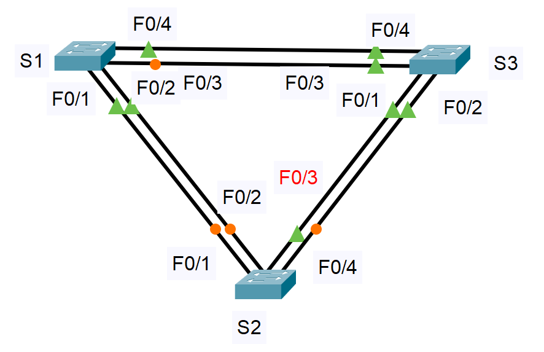
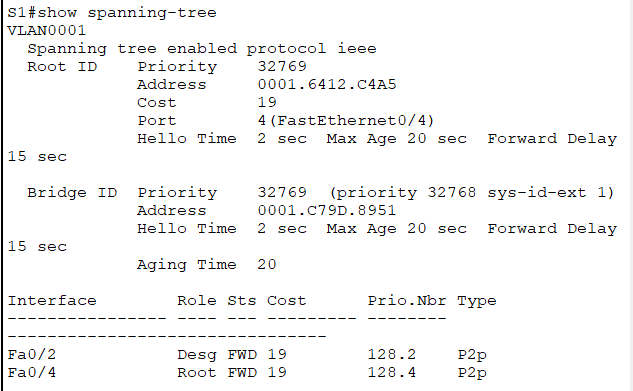
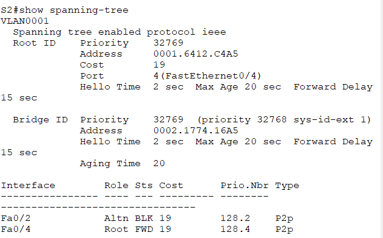
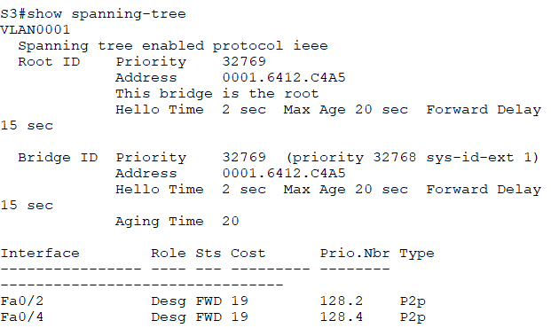
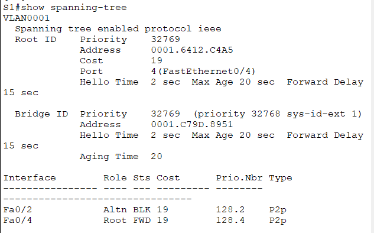
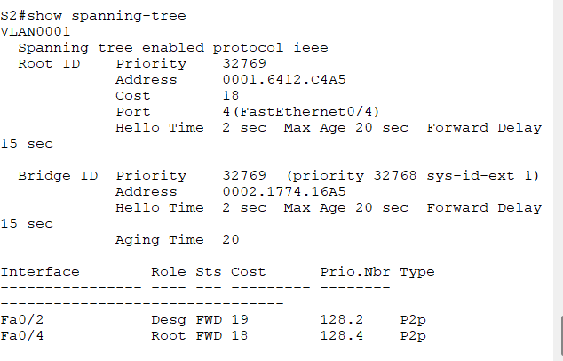
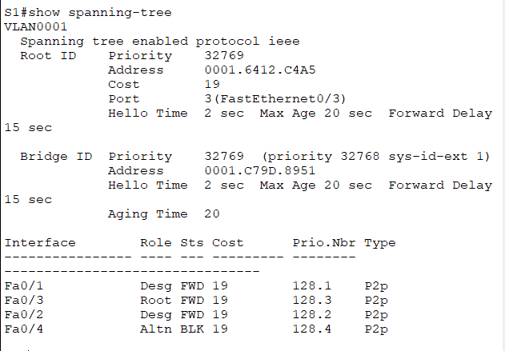
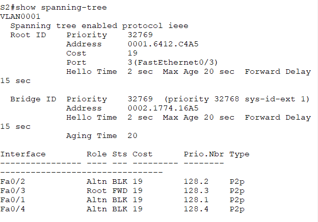
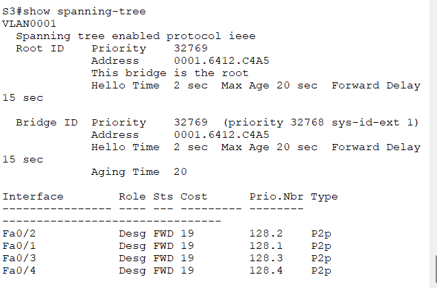

#  Лабораторная работа. Развертывание коммутируемой сети с резервными каналами    

###  Задание:  

 1. Создание сети и настройка основных параметров устройства  
 2. Выбор корневого моста  
 3. Наблюдение за процессом выбора протоколом STP порта, исходя из стоимости портов  
 4. Наблюдение за процессом выбора протоколом STP порта, исходя из приоритета портов  

 
    
  
###  Дано:
#### Таблица адресации:
| Устройство   | Интерфейс   | IP-адресс   |Маска подсети     |   
|-------------:|:------------|:------------|:-----------------|  
| S1           | VLAN 1      | 192.168.1.1 | 255.255.255.0    |        
| S2           | VLAN 1      | 192.168.1.2 | 255.255.255.0    |         
| S3           | VLAN 1      | 192.168.1.3 | 255.255.255.0    |         

    
#### Топология:  
     
  
###  Решение:  
 
###  1. Создание сети и настройка основных параметров устройства; 
  1. Создаем сеть согласно топологии.  
          
  2. Настрайваем базовые параметры для коммутатора  

      [Получим результат S1;][def]  
     
      [Получим результат S2;][def1]  

      [Получим результат S3;][def2]  

      
  3. Проверяем связь. 

     a.	Успешно ли выполняется эхо-запрос от коммутатора S1 на коммутатор S2? Успешно.  
  
      S1#ping 192.168.1.2  
  
      Type escape sequence to abort.  
      Sending 5, 100-byte ICMP Echos to 192.168.1.2, timeout is 2 seconds:  
      !!!!!  
      Success rate is 100 percent (5/5), round-trip min/avg/max = 0/0/0 ms  
          
     b.	Успешно ли выполняется эхо-запрос от коммутатора S1 на коммутатор S3? Успешно.    
  
      S1#ping 192.168.1.3  
  
      Type escape sequence to abort.  
      Sending 5, 100-byte ICMP Echos to 192.168.1.3, timeout is 2 seconds:  
      !!!!!  
      Success rate is 100 percent (5/5), round-trip min/avg/max = 0/0/0 ms  
  
     c.	Успешно ли выполняется эхо-запрос от коммутатора S2 на коммутатор S3? Успешно.    
  
      S2#ping 192.168.1.3  
  
      Type escape sequence to abort.  
      Sending 5, 100-byte ICMP Echos to 192.168.1.3, timeout is 2 seconds:  
      !!!!!  
      Success rate is 100 percent (5/5), round-trip min/avg/max = 0/1/3 ms  
      
###  2. Определение корневого моста;  
  1. Отключаем все порты на коммутаторах:     
      S1(config)#interface range fastEthernet 0/1-24  
      S1(config-if-range)#sh  
      S1(config-if-range)#shutdown  
  
      S1(config)#interface range GigabitEthernet 0/1-2  
      S1(config-if-range)#sh  
      S1(config-if-range)#shutdown  
        
      Аналогично на оставшихся коммутаторах  
  
  2. Настраиваем подключенные порты в качестве транковых:   
      S1(config)#interface range fastEthernet 0/1-4  
      S1(config-if-range)#switchport mode trunk   
      S1(config-if-range)#switchport trunk allowed vlan 1   
       
      Аналогично на оставшихся коммутаторах  
  
  3. Включаем порты F0/2 и F0/4:   
  
      
  
      
  
      

      1. Какой коммутатор является корневым мостом?   
          Корневой мост является S3.  
      2. Почему этот коммутатор был выбран протоколом spanning-tree в качестве корневого моста?  
          S3 имеет наименьший Bridge ID (BID). BID формируется как приоритет + MAC-адрес. У всех коммутаторов приоритет 32769 (32768 + VLAN 1), но MAC-адрес S3 (0001.6412.C4A5) меньше, чем у S1 (0001.C79D.8951) и S2 (0002.1774.16A5). STP выбирает коммутатор с наименьшим BID в качестве корневого моста.  
      3. Какие порты на коммутаторе являются корневыми портами?  
          Fa0/4 на коммутаторе S1 (Role: Root, как указано в выводе S1#show spanning-tree).  
      4. Какие порты на коммутаторе являются назначенными портами?  
          На S3: Fa0/2, Fa0/4; на S1: Fa0/2; на S2: Fa0/2, Fa0/4 (Role: Desg для всех указанных портов).  
      5. Какой порт отображается в качестве альтернативного и в настоящее время заблокирован?  
          На коммутаторе S2: Fa0/2 (предположительно, так как топология кольцевая, но в выводе отсутствует явное указание заблокированного порта; в реальной сети один порт должен быть заблокирован для разрыва петли).  
      6. Почему протокол spanning-tree выбрал этот порт в качестве невыделенного (заблокированного) порта?  
          STP блокирует порт, который не является оптимальным для достижения корневого моста. В кольцевой топологии (S1-S2-S3-S1) путь через S2 к корневому мосту S3 через Fa0/4 короче, чем через Fa0/2 (путь S2 → S1 → S3). Поэтому STP блокирует Fa0/2 на S2, чтобы избежать петли. Заблокированный порт остается в состоянии Alternate, готовый к активации при отказе основного пути.  

###  3.	Наблюдение за процессом выбора протоколом STP порта, исходя из стоимости портов;  
        
   1. Определяем коммутатор с заблокированным портом.  
           
    Коммутатор S2 Порт Fa0/2  
        
   2. Изменяем стоимость порта.

    S2(config)#interface f0/4
    S2(config-if)#spanning-tree vlan 1 cost 18

      
  
      
 
    Почему протокол spanning-tree заменяет ранее заблокированный порт на назначенный порт и блокирует порт, который был назначенным портом на другом коммутаторе?  
    Протокол Spanning Tree определяет назначенный порт на каждом сегменте сети как порт коммутатора, у которого суммарная стоимость пути до корневого моста минимальна. Если стоимость одинакова — выбирается коммутатор с меньшим Bridge ID, а при совпадении Bridge ID — порт с меньшим приоритетом/номером.  

   3. Удаляем изменения стоимости порта.  
  
    S2(config)#interface f0/4  
    S2(config-if)#no spanning-tree vlan 1 cost 18  
  
### 4. Часть 4:	Наблюдение за процессом выбора протоколом STP порта, исходя из приоритета портов.  
  1.  Включаем порты F0/1 и F0/3 на всех коммутаторах.  
  
      
  
      
  
      

    a. Какой порт выбран протоколом STP в качестве порта корневого моста на каждом коммутаторе некорневого моста?  
      S1: Fa0/3  
      S2: Fa0/3  
    b. Почему протокол STP выбрал эти порты в качестве портов корневого моста на этих коммутаторах?  
      Протокол STP выбирает корневой порт (Root Port) на некорневом коммутаторе как порт, обеспечивающий наименьшую суммарную стоимость пути до корневого моста.  

### 	Вопросы для повторения.  
    1. Какое значение протокол STP использует первым после выбора корневого моста, чтобы определить выбор порта?  
        Стоимость пути до корневого моста, суммарная стоимость всех линков от порта до корневого моста. Выбирается порт с минимальной стоимостью.   
    2. Если первое значение на двух портах одинаково, какое следующее значение будет использовать протокол STP при выборе порта?  
        Bridge ID (приоритет + MAC-адрес).  
    3. Если оба значения на двух портах равны, каким будет следующее значение, которое использует протокол STP при выборе порта?  
        Приоритет порта отправителя, а при его равенстве — номер порта отправителя.  

[def]: conf/base_conf_0.md   
[def1]: conf/base_conf_1.md    
[def2]: conf/base_conf_2.md   
