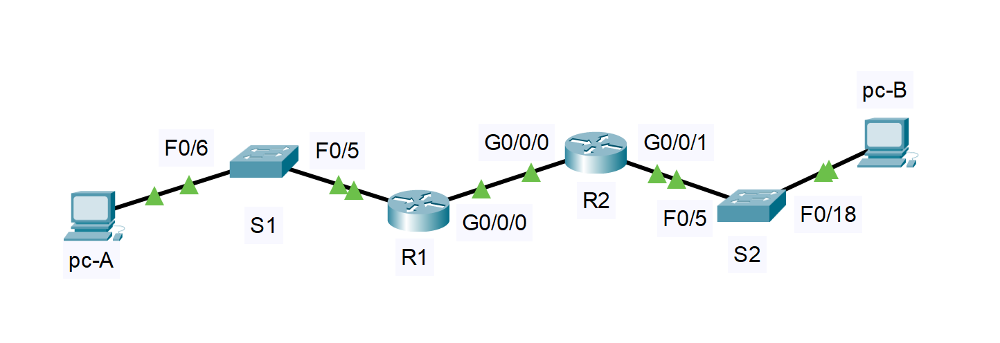

#  Лабораторная работа - Реализация DHCPv6   

###  Задание:  

 1. Создание сети и настройка основных параметров устройства   
 2. Проверка назначения адреса SLAAC от R1   
 3. Настройка и проверка сервера DHCPv6 без гражданства на R1   
 4. Настройка и проверка состояния DHCPv6 сервера на R1  
 5. Настройка и проверка DHCPv6 Relay на R2  

 
    
  
###  Дано:
#### Таблица адресации:
| Устройство   | Интерфейс   | IPv6-fдресс             | 
|-------------:|:------------|:------------------------|  
| R1           | G0/0/0      | 2001:db8:acad:2::1/64   |    
|              | G0/0/1      | 2001:db8:acad:1::1/64   |    
| R2           | G0/0/0      | 2001:db8:acad:2::2/64   |    
|              | G0/0/1      | 2001:db8:acad:3::1/64   |    
| PC-A         | NIC         | DHCP                    |         
| PC-B         | NIC         | DHCP                    |         

    
#### Топология:  
     
  
###  Решение:  
 
###  1. Создание сети и настройка основных параметров устройства; 
  1. Создаем сеть согласно топологии.  
          
  2. Настрайваем параметры для устройств  

      [Получим результат S1;][def]  
      
      [Получим результат S2;][def1]  

      [Получим результат R1;][def2]  

      [Получим результат R2;][def3]  

      
  3. Настройка интерфейсов и маршрутизации для обоих маршрутизаторов.

            R1# configure terminal
            R1(config)# ipv6 unicast-routing                         
            R1(config)# interface gigabitEthernet 0/0/0
            R1(config-if)# ipv6 address 2001:db8:acad:2::1/64        
            R1(config-if)# ipv6 address fe80::1 link-local            
            R1(config-if)# no shutdown
            R1(config-if)# exit
            R1(config)# interface gigabitEthernet 0/0/1
            R1(config-if)# ipv6 address 2001:db8:acad:1::1/64
            R1(config-if)# ipv6 address fe80::1 link-local
            R1(config-if)# no shutdown
            R1(config-if)# exit

            R2(config)# ipv6 unicast-routing
            R2(config)# interface gigabitEthernet 0/0/0
            R2(config-if)# ipv6 address 2001:db8:acad:2::2/64
            R2(config-if)# ipv6 address fe80::2 link-local        
            R2(config-if)# no shutdown
            R2(config-if)# exit
            R2(config)# interface gigabitEthernet 0/0/1
            R2(config-if)# ipv6 address 2001:db8:acad:3::1/64
            R2(config-if)# ipv6 address fe80::1 link-local
            R2(config-if)# no shutdown
            R2(config-if)# exit

   Проверяем

            R1#ping 2001:db8:acad:3::1
            Type escape sequence to abort.
            Sending 5, 100-byte ICMP Echos to 2001:db8:acad:3::1, timeout is 2 seconds:
            !!!!!
            Success rate is 100 percent (5/5), round-trip min/avg/max = 0/0/0 ms

###  2.Проверка назначения адреса SLAAC от R1.   

            C:\>ipconfig 
            FastEthernet0 Connection:(default port)
            Connection-specific DNS Suffix..: 
            Link-local IPv6 Address.........: FE80::20C:85FF:FEBE:50A5
            IPv6 Address....................: 2001:DB8:ACAD:1:20C:85FF:FEBE:50A5
            IPv4 Address....................: 0.0.0.0
            Subnet Mask.....................: 0.0.0.0
            Default Gateway.................: FE80::1
            0.0.0.0

   * Откуда взялась часть адреса с идентификатором хоста?
       Часть адреса с идентификатором хоста взялась из физического MAC-адреса сетевой интерфейсной карты ПК.

###  3. Настройка и проверка сервера DHCPv6 на R1  

   1. Выполниv команду ipconfig /all на PC-A и посмотриv на результат 

            C:\>ipconfig /all

            FastEthernet0 Connection:(default port)

            Connection-specific DNS Suffix..: 
            Physical Address................: 000C.85BE.50A5
            Link-local IPv6 Address.........: FE80::20C:85FF:FEBE:50A5
            IPv6 Address....................: ::
            IPv4 Address....................: 0.0.0.0
            Subnet Mask.....................: 0.0.0.0
            Default Gateway.................: FE80::1
            0.0.0.0
            DHCP Servers....................: 192.168.1.1
            DHCPv6 IAID.....................: 
            DHCPv6 Client DUID..............: 00-01-00-01-42-0B-65-11-00-0C-85-BE-50-A5
            DNS Servers.....................: 2001:DB8:ACAD::254
            0.0.0.0

   2. Настройте R1 для предоставления DHCPv6 без состояния для PC-A, проверим вывод ipconfig /all. 

            C:\>
            ipconfig /all

            FastEthernet0 Connection:(default port)

            Connection-specific DNS Suffix..: STATELESS.com 
            Physical Address................: 000C.85BE.50A5
            Link-local IPv6 Address.........: FE80::20C:85FF:FEBE:50A5
            IPv6 Address....................: 2001:DB8:ACAD:1:20C:85FF:FEBE:50A5
            IPv4 Address....................: 0.0.0.0
            Subnet Mask.....................: 0.0.0.0
            Default Gateway.................: FE80::1
            0.0.0.0
            DHCP Servers....................: 192.168.1.1
            DHCPv6 IAID.....................: 2073437064
            DHCPv6 Client DUID..............: 00-01-00-01-42-0B-65-11-00-0C-85-BE-50-A5
            DNS Servers.....................: 2001:DB8:ACAD::254
            0.0.0.0

###  4. Настройка и проверка сервера DHCPv6 на R2  

   1. Выполниv команду ipconfig /all на PC-ИB и посмотриv на результат 

            C:\>ipconfig /all

            FastEthernet0 Connection:(default port)

            Connection-specific DNS Suffix..: 
            Physical Address................: 00E0.B0D6.E42E
            Link-local IPv6 Address.........: FE80::2E0:B0FF:FED6:E42E
            IPv6 Address....................: 2001:DB8:ACAD:3:2E0:B0FF:FED6:E42E
            IPv4 Address....................: 0.0.0.0
            Subnet Mask.....................: 0.0.0.0
            Default Gateway.................: FE80::1
            0.0.0.0
            DHCP Servers....................: 10.0.0.1
            DHCPv6 IAID.....................: 
            DHCPv6 Client DUID..............: 00-01-00-01-EB-50-99-4E-00-E0-B0-D6-E4-2E
            DNS Servers.....................: ::
            0.0.0.0

   2. Настройте R2 для предоставления DHCPv6 без состояния для PC-2, проверим вывод ipconfig /all. 

            C:\>ipconfig /all

            FastEthernet0 Connection:(default port)

            Connection-specific DNS Suffix..: STATEFUL.com 
            Physical Address................: 00E0.B0D6.E42E
            Link-local IPv6 Address.........: FE80::2E0:B0FF:FED6:E42E
            IPv6 Address....................: 2001:DB8:ACAD:3:2E0:B0FF:FED6:E42E
            IPv4 Address....................: 0.0.0.0
            Subnet Mask.....................: 0.0.0.0
            Default Gateway.................: FE80::1
            0.0.0.0

   * Проверьте подключение с помощью пинга IP-адреса интерфейса R1 G0/0/1.

     C:\>ping 2001:db8:acad:1::1

            Pinging 2001:db8:acad:1::1 with 32 bytes of data:
            Reply from 2001:DB8:ACAD:1::1: bytes=32 time<1ms TTL=254
            Reply from 2001:DB8:ACAD:1::1: bytes=32 time=1ms TTL=254
            Reply from 2001:DB8:ACAD:1::1: bytes=32 time<1ms TTL=254
            Reply from 2001:DB8:ACAD:1::1: bytes=32 time<1ms TTL=254

[def]: conf/base_conf_S1.md   
[def1]: conf/base_conf_S2.md    
[def2]: conf/base_conf_R1.md   
[def3]: conf/base_conf_R2.md   