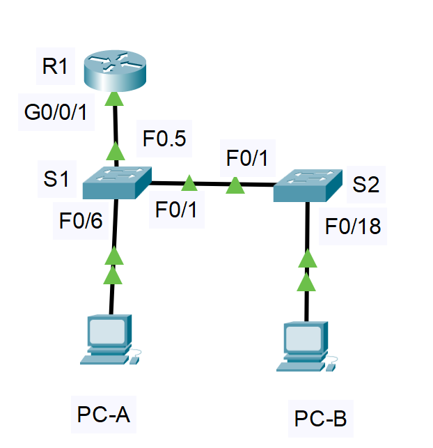

#  Лабораторная работа - Конфигурация безопасности коммутатора   

###  Задание:  

 1. Настройка основного сетевого устройства  
 2. Настройка сетей VLAN   
 3. Настройки безопасности коммутатора.  

 
    
  
###  Дано:
#### Таблица адресации:
| Устройство   | Интерфейс   | IP-адрес       | Маска подсети |
|-------------:|:------------|:---------------|:--------------|  
| R1           | G0/0/1      | 192.168.10.1   | 255.255.255.0 |    
|              | Loopback    | 10.10.1.1      | 255.255.255.0 |  
| S1           | VLAN 10     | 192.168.10.201 | 255.255.255.0 |  
|              | VLAN 10     | 192.168.10.202 | 255.255.255.0 |  
| PC-A         | NIC         |     DHCP       | 255.255.255.0 |  
| PC-B         | NIC         |     DHCP       | 255.255.255.0 |   

    
#### Топология:  
     
  
###  Решение:  
 
###  1. Настройка основного сетевого устройства; 2. Настройка сетей VLAN;   
  1. Создаем сеть согласно топологии.  
          
  2. Настрайваем параметры для устройств  

      [Получим результат S1;][def]  
      
      [Получим результат S2;][def1]  

      [Получим результат R1;][def2]  

  3.  Проверьте с помощью команды show interfaces, отключение согласование DTP   

            S1#show interfaces f0/1 switchport | include Negotiation  
            Negotiation of Trunking: Off  

            S2#show interfaces f0/1 switchport | include Negotiation  
            Negotiation of Trunking: Off  

  4.  Безопасность неиспользуемых портов коммутатора.  

            S1#show interfaces status  
            Port      Name               Status       Vlan       Duplex  Speed Type  
            Fa0/1                        connected    trunk      auto    auto  10/100BaseTX  
            Fa0/2                        disabled 999        auto    auto  10/100BaseTX  
            Fa0/3                        disabled 999        auto    auto  10/100BaseTX  
            Fa0/4                        disabled 999        auto    auto  10/100BaseTX  
            Fa0/5                        connected    trunk      auto    auto  10/100BaseTX  
            Fa0/6                        connected    10         auto    auto  10/100BaseTX  
            Fa0/7                        disabled 999        auto    auto  10/100BaseTX  
            Fa0/8                        disabled 999        auto    auto  10/100BaseTX  
            Fa0/9                        disabled 999        auto    auto  10/100BaseTX  
            Fa0/10                       disabled 999        auto    auto  10/100BaseTX  
            Fa0/11                       disabled 999        auto    auto  10/100BaseTX  
            Fa0/12                       disabled 999        auto    auto  10/100BaseTX  
            Fa0/13                       disabled 999        auto    auto  10/100BaseTX  
            Fa0/14                       disabled 999        auto    auto  10/100BaseTX  
            Fa0/15                       disabled 999        auto    auto  10/100BaseTX  
            Fa0/16                       disabled 999        auto    auto  10/100BaseTX  
            Fa0/17                       disabled 999        auto    auto  10/100BaseTX  
            Fa0/18                       disabled 999        auto    auto  10/100BaseTX  
            Fa0/19                       disabled 999        auto    auto  10/100BaseTX  
            Fa0/20                       disabled 999        auto    auto  10/100BaseTX  
            Fa0/21                       disabled 999        auto    auto  10/100BaseTX  
            Fa0/22                       disabled 999        auto    auto  10/100BaseTX  
            Fa0/23                       disabled 999        auto    auto  10/100BaseTX  
            Fa0/24                       disabled 999        auto    auto  10/100BaseTX  
            Gig0/1                       disabled 999        auto    auto  10/100BaseTX  
            Gig0/2                       disabled 999        auto    auto  10/100BaseTX  

            S2# show interfaces status   
            Port      Name               Status       Vlan       Duplex  Speed Type  
            Fa0/1                        connected    trunk      auto    auto  10/100BaseTX  
            Fa0/2                        disabled 999        auto    auto  10/100BaseTX  
            Fa0/3                        disabled 999        auto    auto  10/100BaseTX  
            Fa0/4                        disabled 999        auto    auto  10/100BaseTX  
            Fa0/5                        disabled 999        auto    auto  10/100BaseTX  
            Fa0/6                        disabled 999        auto    auto  10/100BaseTX  
            Fa0/7                        disabled 999        auto    auto  10/100BaseTX  
            Fa0/8                        disabled 999        auto    auto  10/100BaseTX  
            Fa0/9                        disabled 999        auto    auto  10/100BaseTX  
            Fa0/10                       disabled 999        auto    auto  10/100BaseTX  
            Fa0/11                       disabled 999        auto    auto  10/100BaseTX  
            Fa0/12                       disabled 999        auto    auto  10/100BaseTX  
            Fa0/13                       disabled 999        auto    auto  10/100BaseTX  
            Fa0/14                       disabled 999        auto    auto  10/100BaseTX  
            Fa0/15                       disabled 999        auto    auto  10/100BaseTX  
            Fa0/16                       disabled 999        auto    auto  10/100BaseTX  
            Fa0/17                       disabled 999        auto    auto  10/100BaseTX  
            Fa0/18                       connected    10         auto    auto  10/100BaseTX  
            Fa0/19                       disabled 999        auto    auto  10/100BaseTX  
            Fa0/20                       disabled 999        auto    auto  10/100BaseTX  
            Fa0/21                       disabled 999        auto    auto  10/100BaseTX  
            Fa0/22                       disabled 999        auto    auto  10/100BaseTX  
            Fa0/23                       disabled 999        auto    auto  10/100BaseTX  
            Fa0/24                       disabled 999        auto    auto  10/100BaseTX  
            Gig0/1                       disabled 999        auto    auto  10/100BaseTX  
            Gig0/2                       disabled 999        auto    auto  10/100BaseTX  

###  2. Документирование и реализация функций безопасности порта.     
   1.	На S1, введите команду show port-security interface f0/6  для отображения настроек по умолчанию безопасности порта для интерфейса F0/6.  

      | Функция                                    | Настройка по умолчаниюю |  
      |:-------------------------------------------|:------------------------|  
      |Защита портов                               | Disabled                |  
      |Максимальное количество записей MAC-адресов | 1                       |  
      |Режим проверки на нарушение безопасности    | Shutdown                |  
      |Aging Time                                  | 0 mins                  |  
      |Aging Type                                  | Absolute                |  
      |Sticky Static Address Aging                 | Disable                 |  
      |Sticky MAC Address                          | Disable                 |  

   2. На S1 включим защиту порта на F0 / 6 со следующими настройками:  
 
            S1(config-if)#switchport port-security   
            S1(config-if)#switchport port-security aging time 60  
            S1(config-if)#switchport port-security violation restrict   
            S1(config-if)#switchport port-security maximum 3  
            S1(config-if)#switchport port-security aging type inactivity (В Cisco PT нету)  

            show port-security interface f0/6   
            Port Security              : Enabled  
            Port Status                : Secure-up  
            Violation Mode             : Restrict  
            Aging Time                 : 60 mins  
            Aging Type                 : Absolute  
            SecureStatic Address Aging : Disabled  
            Maximum MAC Addresses      : 3  
            Total MAC Addresses        : 0  
            Configured MAC Addresses   : 0  
            Sticky MAC Addresses       : 0  
            Last Source Address:Vlan   : 0000.0000.0000:0  
            Security Violation Count   : 0  

            S1#show port-security address  
               Secure Mac Address Table  
            -----------------------------------------------------------------------------  
            Vlan    Mac Address       Type                          Ports   Remaining Age  
                                                                              (mins)  
            ----    -----------       ----                          -----   -------------  
            10	0001.43EA.C32C	DynamicConfigured	FastEthernet0/6		-  
            -----------------------------------------------------------------------------  
            Total Addresses in System (excluding one mac per port)     : 0  
            Max Addresses limit in System (excluding one mac per port) :  

   3. На S2 включим защиту порта на F0 / 18 со следующими настройкамиЖ   

            S2(config)#interface fastEthernet 0/18  
            S2(config-if)#switchport port-security   
            S2(config-if)#switchport port-security aging time 60  
            S2(config-if)#switchport port-security violation protect   
            S2(config-if)#switchport port-security maximum 2  

            S2#show port-security interface f0/18  
            Port Security              : Enabled  
            Port Status                : Secure-up  
            Violation Mode             : Protect  
            Aging Time                 : 60 mins  
            Aging Type                 : Absolute  
            SecureStatic Address Aging : Disabled  
            Maximum MAC Addresses      : 2  
            Total MAC Addresses        : 0  
            Configured MAC Addresses   : 0  
            Sticky MAC Addresses       : 0  
            Last Source Address:Vlan   : 0000.0000.0000:0  
            Security Violation Count   : 0  

            S2#show port-security address  
                           Secure Mac Address Table  
            -----------------------------------------------------------------------------  
            Vlan    Mac Address       Type                          Ports   Remaining Age  
                                                                              (mins)  
            ----    -----------       ----                          -----   -------------  
            10	0090.2BBB.A9BE	DynamicConfigured	FastEthernet0/18		-  
            -----------------------------------------------------------------------------  
            Total Addresses in System (excluding one mac per port)     : 0  
            Max Addresses limit in System (excluding one mac per port) : 1024  
            

###  3. Реализовать безопасность DHCP snooping.  
   1. На S2 включим DHCP snooping и настроим DHCP snooping во VLAN 10  

            S2(config)#ip dhcp snooping   
            S2(config)#ip dhcp snooping vlan 10  
            S2(config)#interface fastEthernet 0/1  
            S2(config-if)#ip dhcp snooping trust   
            S2(config-if)#exit  
            S2(config-if)#interface fastEthernet 0/18  
            S2(config-if)#no ip dhcp snooping limit rate 5  

            Switch DHCP snooping is enabled  
            DHCP snooping is configured on following VLANs:  
            10  
            Insertion of option 82 is enabled  
            Option 82 on untrusted port is not allowed  
            Verification of hwaddr field is enabled  
            Interface                  Trusted    Rate limit (pps)  
            -----------------------    -------    ----------------  
            FastEthernet0/1            yes        unlimited         
            FastEthernet0/18           no         5   

            S2#show ip dhcp snooping binding   
            MacAddress          IpAddress        Lease(sec)  Type           VLAN  Interface  
            ------------------  ---------------  ----------  -------------  ----  -----------------  
            00:90:2B:BB:A9:BE   192.168.10.11    0           dhcp-snooping  10    FastEthernet0/18  
            Total number of bindings: 1  

   2. На PC-B Выполним  

            C:\Users\Student> ipconfig /release  
            C:\Users\Student> ipconfig /renew  

   3. Проверим привязку отслеживания DHCP с помощью команды show ip dhcp snooping binding  

            S2#show ip dhcp snooping binding   
            MacAddress          IpAddress        Lease(sec)  Type           VLAN  Interface  
            ------------------  ---------------  ----------  -------------  ----  -----------------  
            00:90:2B:BB:A9:BE   192.168.10.10    0           dhcp-snooping  10    FastEthernet0/18  
            Total number of bindings: 1

### 4. Реализация PortFast и BPDU Guard  

            S1#show spanning-tree interface FastEthernet0/6 detail  
            Port 6 (FastEthernet0/6) of VLAN0010 is designated forwarding  
            Port path cost 19, Port priority 128, Port Identifier 128.6  
            Designated root has priority 32778, address 0002.4AD4.7322  
            Designated bridge has priority 32778, address 0007.ECEE.628C  
            Designated port id is 128.6, designated path cost 19  
            Timers: message age 16, forward delay 0, hold 0  
            Number of transitions to forwarding state: 1  
            The port is in the portfast mode  
            Link type is point-to-point by default  

   Так как отсутствует
            
            Bpdu guard is enabled
            BPDU: sent 128, received 0

   Проверяем через show running-config  

            S1#show running-config   
            interface FastEthernet0/6  
            switchport access vlan 10  
            switchport mode access  
            switchport port-security  
            switchport port-security maximum 3  
            switchport port-security violation restrict   
            switchport port-security aging time 60  
            spanning-tree portfast  
            spanning-tree bpduguard enable  

### 5. Проверим наличие сквозного подключения.  
  
            C:\>ping 192.168.10.202  
            Pinging 192.168.10.202 with 32 bytes of data:  
            Reply from 192.168.10.202: bytes=32 time<1ms TTL=255  
            Reply from 192.168.10.202: bytes=32 time<1ms TTL=255  
  
            C:\>ping 192.168.10.1  
            Pinging 192.168.10.1 with 32 bytes of data:  
            Reply from 192.168.10.1: bytes=32 time<1ms TTL=255  
            Reply from 192.168.10.1: bytes=32 time<1ms TTL=255  
  
            C:\>ping 192.168.10.10  
            Pinging 192.168.10.10 with 32 bytes of data:  
            Reply from 192.168.10.10: bytes=32 time<1ms TTL=128  
            Reply from 192.168.10.10: bytes=32 time<1ms TTL=128  
  
            C:\>ping 192.168.10.201  
            Pinging 192.168.10.201 with 32 bytes of data:  
            Reply from 192.168.10.201: bytes=32 time<1ms TTL=255  
            Reply from 192.168.10.201: bytes=32 time<1ms TTL=255  

### Вопросы для повторения:  

1.	С точки зрения безопасности порта на S2, почему нет значения таймера для оставшегося возраста в минутах, когда было сконфигурировано динамическое обучение - sticky?  
  
        Так как адреса, выученные через sticky, по умолчанию считаются статическими

2.	Что касается безопасности порта на S2, если вы загружаете скрипт текущей конфигурации на S2, почему порту 18 на PC-B никогда не получит IP-адрес через DHCP?  
  
        Так как в конфигурации порта 18 уже зафиксирован другой MAC-адрес, который не совпадает с MAC-адресом карты сети PC-B.  

3.	Что касается безопасности порта, в чем разница между типом абсолютного устаревания и типом устаревание по неактивности?  
  
         Разница заключается в логике работы таймера старения.

[def]: conf/base_conf_S1.md   
[def1]: conf/base_conf_S2.md    
[def2]: conf/base_conf_R1.md   
 