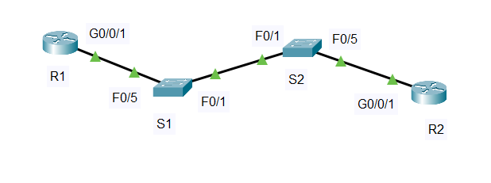

#  Лабораторная работа. Настройка и проверка расширенных списков контроля доступа. 

###  Задание:  

 1. Создание сети и настройка основных параметров устройства.   
 2. Настройка и проверка списков расширенного контроля доступа.       

 
    
  
###  Дано:
#### Таблица адресации:
| Устройство   | Интерфейс   | IP-адрес       | Маска подсети | Шлюз по умолчанию |  
|-------------:|:------------|:---------------|:--------------|:------------------|    
| R1           | G0/0/1      |      ---       |       ---     |    ---            |     
|              | G0/0/1.20   | 10.20.0.1      | 255.255.255.0 |                   |     
|              | G0/0/1.30   | 10.30.0.1      | 255.255.255.0 |                   |     
|              | G0/0/1.40   | 10.49.0.1      | 255.255.255.0 |                   |     
|              | G0/0/1.1000 |      ---       |      ---      |                   |     
|              | Loopback    | 172.16.1.1     | 255.255.255.0 |                   |   
| R2           | G0/0/1      | 10.20.0.4      | 255.255.255.0 |                   |    
| S1           | VLAN 20     | 10.20.0.2      | 255.255.255.0 | 10.20.0.1         |    
| S2           | VLAN 20     | 10.20.0.3      | 255.255.255.0 | 10.20.0.1         |    
| PC-A         | NIC         | 10.30.0.10     | 255.255.255.0 | 10.30.0.1         |    
| PC-B         | NIC         | 10.40.0.10     | 255.255.255.0 | 10.40.0.1         |    

#### Таблица VLAN:
|   VLAN   |    Имя    |       Назначенный интерфейс        |  
|:---------|:----------|:-----------------------------------|
|    20    | Managment | S2: F0/5                           |
|    30    | Operations| S1: F0/6                           |
|    40    | Sales     | S2: F0/18                          |
|    999   | ParkingLot| S1: F0/2-4,F0/7-24,G0/1-2          |
|          |           | S2: F0/2-4,F0/6-17,F0/19-24,G0/1-2 |
|   1000   | Sobstvenay|      ---                           |
    
#### Топология:  
     
  
###  Решение:  
 
###  1.Создание сети и настройка основных параметров устройства;   
  1. Создаем сеть согласно топологии.  
          
  2. Настрайваем параметры для устройств  

      [Получим результат S1;][def]  
      
      [Получим результат S2;][def1]  

      [Получим результат R1;][def2]  

      [Получим результат R2;][def3]

###  2. Настройка сетей VLAN на коммутаторах.      
   1.	Создайте сети VLAN на коммутаторах. 
        a. Настройка коммутатора S1.  
    
            S1(config)#vlan 20  
            S1(config-vlan)#name Managment  
            S1(config)#vlan 30  
            S1(config-vlan)#name Operations  
            S1(config)#vlan 40  
            S1(config-vlan)#name Sales  
            S1(config)#vlan 999  
            S1(config-vlan)#name ParkingLot  
            S1(config-vlan)#vlan 1000  
       
            S1(config)#interface FastEthernet 0/6    
            S1(config-if)#switchport mode access     
            S1(config-if)#switchport access vlan 30    
            S1(config)#interface range f0/2-4,f0/7-24,g0/1-2    
            S1(config-if-range)#switchport mode access     
            S1(config-if-range)#switchport access vlan 999    
            S1(config-if-range)#shutdown     
  
        b. Настройка коммутатора S2.   
    
            S2(config)#vlan 20  
            S2(config-vlan)#name Management  
            S2(config)#vlan 30  
            S2(config-vlan)#name Operations  
            S2(config)#vlan 40  
            S2(config-vlan)#name Sales  
            S2(config)#vlan 999  
            S2(config-vlan)#name ParkingLot  
            S2(config)#vlan 1000  
  
            S2(config)#interface fastEthernet 0/5  
            S2(config-if)#switchport mode access   
            S2(config-if)#switchport access vlan 20  
            S2(config)#interface f0/18  
            S2(config-if)#switchport mode access   
            S2(config-if)#switchport access vlan 40  
            S2(config)#interface range f0/2-4,f0/6-17,f0/19-24,g0/1-2  
            S2(config-if-range)#switchport mode access   
            S2(config-if-range)#switchport access vlan 999  
            S2(config-if-range)#shutdown   
  
    
###  3. Настройте транки (магистральные каналы).    
   1. Вручную настроим магистральный интерфейс F0/1.    
    
            S1(config)#interface fastEthernet 0/1  
            S1(config-if)#switchport mode trunk   
            S1(config-if)#switchport trunk native vlan 1000  
            S1(config-if)#switchport trunk allowed vlan 20,30,40  
  
            S2(config)#interface f0/1  
            S2(config-if)#switchport mode trunk   
            S2(config-if)#switchport trunk native vlan 1000  
            S2(config-if)#switchport trunk allowed vlan 20,30,40  
  
  
   2. Вручную настроим магистральный интерфейс F0/5 на коммутаторе S1..     
       
            S1(config)#interface f 0/5  
            S1(config-if)#switchport mode trunk   
            S1(config-if)#switchport trunk native vlan 1000  
            S1(config-if)#switchport trunk allowed vlan 20,30,40  
 ______________________________________________________________ Дальше не делал
        Проверка:  
            
            R2#show ip route ospf   
            O*E2 0.0.0.0/0 [110/1] via 10.53.0.1, 00:12:35, GigabitEthernet0/0/1  
  
   3. Добавим конфигурацию, необходимую для OSPF для обработки R2 Loopback 1 как сети точка-точка.  
  
            R2(config)# interface Loopback1  
            R2(config-if)# ip ospf network point-to-point  
            R2(config-if)# end  
            R2# clear ip ospf process  
              
        Проверка:  
          
            R1# show ip route ospf  
            O    192.168.1.0/24 [110/2] via 10.53.0.2, GigabitEthernet0/0/1  
  
   4. На R2 добавим конфигурацию, необходимую для предотвращения отправки объявлений OSPF в сеть Loopback 1.  
   
            R2(config)# router ospf 56  
            R2(config-router)# passive-interface Loopback1  

        Проверка:    
            
            R2#show ip ospf interface loopback 1  
  
            Loopback1 is up, line protocol is up  
            Internet address is 192.168.1.1/24, Area 0  
            Process ID 56, Router ID 2.2.2.2, Network Type POINT-TO-POINT, Cost: 1  
            Transmit Delay is 1 sec, State POINT-TO-POINT,  
            Timer intervals configured, Hello 10, Dead 40, Wait 40, Retransmit 5  
               No Hellos (Passive interface)   #<<<<<< Пассивный интерфейс  
            Index 1/1, flood queue length 0  
            Next 0x0(0)/0x0(0)  
            Last flood scan length is 1, maximum is 1  
            Last flood scan time is 0 msec, maximum is 0 msec  
            Suppress hello for 0 neighbor(s)  
  
   5. Изменение базовой пропускной способности для маршрутизаторов.
  
            R1(config)# router ospf 56  
            R1(config-router)# auto-cost reference-bandwidth 1000  
            R1(config-router)# end  
            R1# clear ip ospf process  
  
            R2(config)# router ospf 56  
            R2(config-router)# auto-cost reference-bandwidth 1000  
            R2(config-router)# end  
            R2# clear ip ospf process  
              
        Сообщение в консоли:  
  
            R1#  
            00:27:30: %OSPF-5-ADJCHG: Process 56, Nbr 2.2.2.2 on GigabitEthernet0/0/1 from FULL to DOWN, Neighbor Down: Adjacency forced to reset  
  
            00:27:30: %OSPF-5-ADJCHG: Process 56, Nbr 2.2.2.2 on GigabitEthernet0/0/1 from FULL to DOWN, Neighbor Down: Interface down or detached  
  
            00:28:30: %OSPF-5-ADJCHG: Process 56, Nbr 2.2.2.2 on GigabitEthernet0/0/1 from LOADING to FULL, Loading Done  
  
            R2#  
            00:27:39: %OSPF-5-ADJCHG: Process 56, Nbr 1.1.1.1 on GigabitEthernet0/0/1 from FULL to DOWN, Neighbor Down: Adjacency forced to reset  
  
            00:27:39: %OSPF-5-ADJCHG: Process 56, Nbr 1.1.1.1 on GigabitEthernet0/0/1 from FULL to DOWN, Neighbor Down: Interface down or detached  
  
            00:28:30: %OSPF-5-ADJCHG: Process 56, Nbr 1.1.1.1 on GigabitEthernet0/0/1 from LOADING to FULL, Loading Done  
          
### 4. Убедитесь, что оптимизация OSPFv2 реализовалась.   
  
            R1#show ip ospf interface GigabitEthernet0/0/1  
  
            GigabitEthernet0/0/1 is up, line protocol is up  
            Internet address is 10.53.0.1/24, Area 0  
            Process ID 56, Router ID 1.1.1.1, Network Type >>>BROADCAST<<, Cost: 10  
            Transmit Delay is 1 sec, State DR, Priority >>>50<<<  
            Designated Router (ID) 1.1.1.1, Interface address 10.53.0.1  
            Backup Designated Router (ID) 2.2.2.2, Interface address 10.53.0.2  
            Timer intervals configured, >>>Hello 30<<<, >>>Dead 120<<<, Wait 120, Retransmit 5  
               Hello due in 00:00:12  
            Index 1/1, flood queue length 0  
            Next 0x0(0)/0x0(0)  
            Last flood scan length is 1, maximum is 1  
            Last flood scan time is 0 msec, maximum is 0 msec  
            Neighbor Count is 1, Adjacent neighbor count is 1  
               Adjacent with neighbor 2.2.2.2  (Backup Designated Router)  
            Suppress hello for 0 neighbor(s)  
  
            R1#show ip route ospf  
            O    192.168.1.0 [110/10] via 10.53.0.2, 00:08:00, GigabitEthernet0/0/1  
  
            R2#ping 172.16.1.1  
            Type escape sequence to abort.  
            Sending 5, 100-byte ICMP Echos to 172.16.1.1, timeout is 2 seconds:  
            !!!!!  
            Success rate is 100 percent (5/5), round-trip min/avg/max = 0/0/1 ms  
   
* Вопрос: Почему стоимость OSPF для маршрута по умолчанию отличается от стоимости OSPF в R1 для сети 192.168.1.0/24? 
   
         Маршрут по умолчанию:  
           * Маршрут по умолчанию не накапливают стоимость через OSPF-домен  
         Сеть 192.168.1.0/24:  
           * Стоимость накапливается по всем интерфейсам на пути  

[def]: conf/base_conf_S1.md   
[def1]: conf/base_conf_S2.md    
[def2]: conf/base_conf_R1.md   
[def3]: conf/base_conf_R2.md   
 