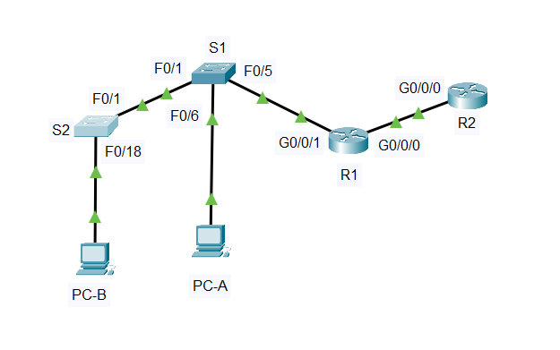

#  Лабораторная работа - Настройка NAT для IPv4 

###  Задание:  

 1. Создание сети и настройка основных параметров устройства.   
 2. Настройка и проверка NAT для IPv4.   
 3. Настройка и проверка PAT для IPv4.    
 4. Настройка и проверка статического NAT для IPv4.    

 
    
  
###  Дано:
#### Таблица адресации:
| Устройство   | Интерфейс   | IP-адрес        | Маска подсети   |
|-------------:|:------------|:----------------|:----------------|  
| R1           | G0/0/0      | 209.165.200.230 | 255.255.255.248 |    
|              | G0/0/1      | 192.168.1.1     | 255.255.255.0   | 
| R2           | G0/0/0      | 209.165.200.225 | 255.255.255.248 |
|              | G0/0/0      | 209.165.200.1   | 255.255.255.224 |  
| S1           | VLAN 1      | 192.168.1.11    | 255.255.255.0   | 
| S2           | VLAN 1      | 192.168.1.12    | 255.255.255.0   | 
| PC-A         | NIC         | 192.168.1.2     | 255.255.255.0   | 
| PC-B         | NIC         | 192.168.1.3     | 255.255.255.0   | 

#### Топология:  
     
  
###  Решение:  
 
###  1.Создание сети и настройка основных параметров устройства;   
  1. Создаем сеть согласно топологии.  
          
  2. Настрайваем параметры для устройств  

      [Получим результат S1;][def]  
      
      [Получим результат S2;][def1]  

      [Получим результат R1;][def2]  

      [Получим результат R2;][def3]

###  2. Настройка и проверка NAT для IPv4.      
   1. Настроим NAT на R1, используя пул из трех адресов 209.165.200.226-209.165.200.228.   
  
            R1(config)#access-list 1 permit 192.168.1.0 0.0.0.255  
            R1(config)#ip nat pool PUBLIC_ACCESS 209.165.200.226 209.165.200.228 netmask 255.255.255.248  
            R1(config)#ip nat inside source list 1 pool PUBLIC_ACCESS   
            R1(config)#interface gigabitEthernet 0/0/1  
            R1(config-if)#ip nat inside   
            R1(config-if)#exit  
            R1(config)#interface gigabitEthernet 0/0/0  
            R1(config-if)#ip nat outside   
     
      Проверка:  
    a.	С PC-B,  запустите эхо-запрос интерфейса Lo1 (209.165.200.1) на R2. Если эхо-запрос не прошел, выполните процес поиска и устранения неполадок. На R1 отобразите таблицу NAT на R1 с помощью команды show ip nat translations.   
  
            C:\>ping 209.165.200.1    
            Reply from 209.165.200.1: bytes=32 time<1ms TTL=254   
  
            R1#show ip nat translations   
            Pro  Inside global     Inside local       Outside local      Outside global  
            icmp 209.165.200.226:21192.168.1.3:21     209.165.200.1:21   209.165.200.1:21  
            icmp 209.165.200.226:22192.168.1.3:22     209.165.200.1:22   209.165.200.1:22  
            icmp 209.165.200.226:23192.168.1.3:23     209.165.200.1:23   209.165.200.1:23  
            icmp 209.165.200.226:24192.168.1.3:24     209.165.200.1:24   209.165.200.1:24  
  
            Во что был транслирован внутренний локальный адрес PC-B? 
                209.165.200.226
            Какой тип адреса NAT является переведенным адресом?
                Это Inside Global 
        
    b.	С PC-A, запустите эхо-запрос интерфейса Lo1 (209.165.200.1) на R2. Если эхо-запрос не прошел, выполните отладку. На R1 отобразите таблицу NAT на R1 с помощью команды show ip nat translations.  

            C:\>ping 209.165.200.1  
            Reply from 209.165.200.1: bytes=32 time<1ms TTL=254  
            
            R1#show ip nat translations   
            Pro  Inside global     Inside local       Outside local      Outside global  
            icmp 209.165.200.227:10192.168.1.2:10     209.165.200.1:10   209.165.200.1:10  
            icmp 209.165.200.227:11192.168.1.2:11     209.165.200.1:11   209.165.200.1:11  
            icmp 209.165.200.227:12192.168.1.2:12     209.165.200.1:12   209.165.200.1:12  
            icmp 209.165.200.227:5 192.168.1.2:5      209.165.200.1:5    209.165.200.1:5  
            icmp 209.165.200.227:6 192.168.1.2:6      209.165.200.1:6    209.165.200.1:6  
            icmp 209.165.200.227:7 192.168.1.2:7      209.165.200.1:7    209.165.200.1:7  
            icmp 209.165.200.227:8 192.168.1.2:8      209.165.200.1:8    209.165.200.1:8  
            icmp 209.165.200.227:9 192.168.1.2:9      209.165.200.1:9    209.165.200.1:9  
  
    c.	Генерирует трафик с нескольких устройств для наблюдения PAT. На PC-A и PC-B используйте параметр -t с командой ping, чтобы отправить безостановочный ping на интерфейс Lo1 R2 (ping -t 209.165.200.1), затем вернитесь к R1 и выполните команду show ip nat translations:

            R1#show ip nat translations   
            Pro  Inside global     Inside local       Outside local      Outside global  
            icmp 209.165.200.227:31192.168.1.3:31     209.165.200.1:31   209.165.200.1:31  
            icmp 209.165.200.228:26192.168.1.2:26     209.165.200.1:26   209.165.200.1:26  

            Как маршрутизатор отслеживает, куда идут ответы?   
                Маршрутизатор отслеживает, куда направлять ответы, с помощью таблицы трансляций NAT.  
    
    d.	PAT в пул является очень эффективным решением для малых и средних организаций. Тем не менее есть неиспользуемые адреса IPv4, задействованные в этом сценарии. Мы перейдем к PAT с перегрузкой интерфейса, чтобы устранить эту трату IPv4 адресов. Остановите ping на PC-A и PC-B с помощью комбинации клавиш Control-C, затем очистите трансляции и статистику:  
  
            R1#clear ip nat translation *
            R1#clear ip nat statistics (Нету в PT)
    
   2. На R1 удалим команды преобразования nat pool.   
  
            R1(config)#no ip nat inside source list 1 pool PUBLIC_ACCESS overload   
            R1(config)#no ip nat pool PUBLIC_ACCESS  
  
   3. Добавим команду PAT overload, указав внешний интерфейс.   
  
            R1(config)#ip nat inside source list 1 interface g0/0/0 overload   
  
   4. Протестируем и проверим конфигурацию.  

   a.	Давайте проверим PAT, чтобы интерфейс работал. С PC-B,  запустите эхо-запрос интерфейса Lo1 (209.165.200.1) на R2. Если эхо-запрос не прошел, выполните отладку. На R1 отобразите таблицу NAT на R1 с помощью команды show ip nat translations.  
  
            R1#show ip nat translations   
            Pro  Inside global     Inside local       Outside local      Outside global  
            icmp 209.165.200.230:262192.168.1.3:262    209.165.200.1:262  209.165.200.1:262  
             
   b.	Сделайте трафик с нескольких устройств для наблюдения PAT. На PC-A и PC-B используйте параметр -t с командой ping для отправки безостановочного ping на интерфейс Lo1 R2 (ping -t 209.165.200.1). На S1 и S2 выполните привилегированную команду exec ping 209.165.200.1 повторить 2000. Затем вернитесь к R1 и выполните команду show ip nat translations.  
    
            R1#show ip nat translations   
            Pro  Inside global     Inside local       Outside local      Outside global  
            icmp 209.165.200.230:230192.168.1.2:230    209.165.200.1:230  209.165.200.1:230 
            icmp 209.165.200.230:271192.168.1.3:271    209.165.200.1:271  209.165.200.1:271  
  
  ###  3. Настройка и проверка статического NAT для IPv4.   

   1. На R1 очистим текущие трансляции и статистику.   
  
            R1#clear ip nat translation *
            R1#clear ip nat statistics (Нету в PT) 

   2. На R1 настроим команду NAT, необходимую для статического сопоставления внутреннего адреса с внешним адресом.  
  
            ip nat inside source static 192.168.1.2 209.165.200.229   

   3. Протестируем и проверим конфигурацию.   
    
   a.	Давайте проверим, что статический NAT работает. На R1 отобразите таблицу NAT на R1 с помощью команды show ip nat translations, и вы увидите статическое сопоставление.    
          
            R1#show ip nat translations   
            Pro  Inside global     Inside local       Outside local      Outside global  
            ---  209.165.200.229   192.168.1.2        ---                ---  
    
    b.	Таблица перевода показывает, что статическое преобразование действует. Проверьте это, запустив ping  с R2 на 209.165.200.229. Плинги должны работать.  
           
            R2#ping 209.165.200.229  
            Type escape sequence to abort.  
            Sending 5, 100-byte ICMP Echos to 209.165.200.229, timeout is 2 seconds:  
            !!!!!  
            Success rate is 100 percent (5/5), round-trip min/avg/max = 0/0/0 ms  
     
    c.	На R1 отобразите таблицу NAT на R1 с помощью команды show ip nat translations, и вы увидите статическое сопоставление и преобразование на уровне порта для входящих pings.  
          
            R1#show ip nat translations   
            Pro  Inside global     Inside local       Outside local      Outside global  
            icmp 209.165.200.229:45192.168.1.2:45     209.165.200.225:45 209.165.200.225:45  
            ---  209.165.200.229   192.168.1.2        ---                ---  

          

[def]: conf/base_conf_S1.md   
[def1]: conf/base_conf_S2.md    
[def2]: conf/base_conf_R1.md   
[def3]: conf/base_conf_R2.md   
 