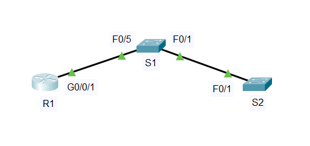

#  Лабораторная работа - Настройка протоколов CDP, LLDP и NTP 

###  Задание:  

 1. Создание сети и настройка основных параметров устройства.   
 2. Обнаружение сетевых ресурсов с помощью протокола CDP.    
 3. Обнаружение сетевых ресурсов с помощью протокола LLDP.      
 4. Настройка и проверка NTP.    
 
###  Дано:
#### Таблица адресации:
| Устройство   | Интерфейс   | IP-адрес        | Маска подсети   | Шлюз по умолчанию |  
|-------------:|:------------|:----------------|:----------------|:------------------|  
| R1           | Loopback1   | 172.16.1.1      | 255.255.255.0   |                   |     
|              | G0/0/1      | 10.22.0.1       | 255.255.255.0   |                   |   
| S1           | VLAN 1      | 10.22.0.2       | 255.255.255.0   | 10.22.0.1         |  
| S2           | VLAN 1      | 10.22.0.3       | 255.255.255.0   | 10.22.0.1         |   

#### Топология:  
     
  
###  Решение:  
 
###  1.Создание сети и настройка основных параметров устройства;   
  1. Создаем сеть согласно топологии.  
          
  2. Настрайваем параметры для устройств  

      [Получим результат S1;][def]  
      
      [Получим результат S2;][def1]  

      [Получим результат R1;][def2]  

###  2. Обнаружение сетевых ресурсов с помощью протокола CDP.      

   1. На R1 используем соответствующую команду show cdp, чтобы определить, сколько интерфейсов включено CDP, сколько из них включено и сколько отключено.   
    
            R1#show cdp interface  
            Vlan1 is administratively down, line protocol is down  
            Sending CDP packets every 60 seconds  
            Holdtime is 180 seconds  
            GigabitEthernet0/0/0 is administratively down, line protocol is down  
            Sending CDP packets every 60 seconds  
            Holdtime is 180 seconds  
            GigabitEthernet0/0/1 is up, line protocol is up  
            Sending CDP packets every 60 seconds  
            Holdtime is 180 seconds  
  
            Интерфейсов с включённым CDP: 3  
            Активных: 1   

   2. На R1 используем соответствующую команду show cdp, чтобы определить версию IOS, используемую на S1.   
  
            R1#show cdp entry S1  
  
            Device ID: S1  
            Entry address(es):   
            IP address : 10.22.0.2  
            Platform: cisco 2960, Capabilities: Switch  
            Interface: GigabitEthernet0/0/1, Port ID (outgoing port): FastEthernet0/5  
            Holdtime: 168  
   
            Version :  
            Cisco IOS Software, C2960 Software (C2960-LANBASEK9-M), Version 15.0(2)SE4, RELEASE SOFTWARE (fc1)  
            Technical Support: http://www.cisco.com/techsupport  
            Copyright (c) 1986-2013 by Cisco Systems, Inc.  
            Compiled Wed 26-Jun-13 02:49 by mnguyen  
  
            advertisement version: 2  
            Duplex: full  
              
            Какая версия IOS используется на  S1?  
                Version 15.2(4)  

   3. На S1 используем соответствующую команду show cdp, чтобы определить, сколько пакетов CDP было выданных.   
  
    Так как show cdp traffic отсутствует в Cisco PT  
    Используем команду  "show cdp neighbors ", чтоб подтвердить активный обмен пакетами.   

            S1#show cdp neighbors   
            Capability Codes: R - Router, T - Trans Bridge, B - Source Route Bridge  
                            S - Switch, H - Host, I - IGMP, r - Repeater, P - Phone  
            Device ID    Local Intrfce   Holdtme    Capability   Platform    Port ID  
            R1           Fas 0/5          153            R       ISR4300     Gig 0/0/1  
            S2           Fas 0/1          153            S       2960        Fas 0/1  
  
   4. Отключить CDP глобально на всех устройствах .  

            R1(config)#no cdp run 
            S1(config)#no cdp run
            S2(config)#no cdp run
            
            Проверим:
            R1#show cdp 
            % CDP is not enabled
        
            Добавился IP адресс
 
###  3. Обнаружение сетевых ресурсов с помощью протокола LLDP.   

   1. Введем соответствующую команду lldp, чтобы включить LLDP на всех устройствах в топологии.   

            R1(config)#lldp run   
            S1(config)#lldp run  
            S2(config)#lldp run   

   2.	На S1 выполним соответствующую команду lldp, чтобы предоставить подробную информацию о S2.   
  
            S1#show lldp neighbors detail 
            ------------------------------------------------
            Chassis id: 0001.6377.D301
            Port id: Fa0/1
            Port Description: FastEthernet0/1
            System Name: S2
            System Description:
            Cisco IOS Software, C2960 Software (C2960-LANBASEK9-M), Version 15.0(2)SE4, RELEASE SOFTWARE (fc1)
            Technical Support: http://www.cisco.com/techsupport
            Copyright (c) 1986-2013 by Cisco Systems, Inc.
            Compiled Wed 26-Jun-13 02:49 by mnguyen
            Time remaining: 90 seconds
            System Capabilities: B
            Enabled Capabilities: B
            Management Addresses - not advertised
            Auto Negotiation - supported, enabled
            Physical media capabilities:
               100baseT(FD)
               100baseT(HD)
               1000baseT(HD)
            Media Attachment Unit type: 10
            Vlan ID: 1

      Что такое chassis ID  для коммутатора S2?
         Chassis ID коммутатора S2, видимый соседям через LLDP: 0001.6377.D301 (Индификатор устройства).  

###  4. Настройка NTP.  

   1. Выведим на экран текущее время.  

   | Дата       |Время     | Часовой пояс| Источник врмени |  
   |:-----------|:---------|:------------|:----------------|   
   | 01.03.1993 | 00:21:48 |  UTC        | *               |  

   2. Установим время.  

            R1#clock set 17:32:00 22 apr 2026  
            R1(config)#clock timezone Izh 4
   3. Настроим главный сервер NTP.  

      R1(config)#ntp master 4  

   4. Настроим клиентов NTP.  

            S1#show clock   
            S2#show clock   

   | Дата       |Время     | Часовой пояс| Коммутатор |  
   |:-----------|:---------|:------------|:-----------|   
   | 01.03.1993 | 00:31:48 |  UTC        | S1         |    
   | 01.03.1993 | 00:31:48 |  UTC        | S1         |   

            S1(config)#ntp server 10.22.0.1
            S2(config)#ntp server 10.22.0.1

   5. Проверим настройку NTP. 

            S1#show ntp associations   
            address         ref clock       st   when     poll    reach  delay          offset            disp  
            ~10.22.0.1     127.127.1.1     4    3        16      377    0.00           -14426996.00      0.12  
            * sys.peer, # selected, + candidate, - outlyer, x falseticker, ~ configured  
  
            S2#show ntp associations     
            address         ref clock       st   when     poll    reach  delay          offset            disp  
            ~10.22.0.1     127.127.1.1     4    7        16      377    0.00           -14426996.00      0.12  
            * sys.peer, # selected, + candidate, - outlyer, x falseticker, ~ configured  
             
            S1#show clock 
            *21:48:2.930 UTC Wed Apr 22 2026

            S2#show clock 
            *21:47:56.384 UTC Wed Apr 22 2026

 ### Вопрос для повторения.
   
   1. Для каких интерфейсов в пределах сети не следует использовать протоколы обнаружения сетевых ресурсов? Поясните ответ.
   
   Ответ: Протоколы обнаружения сетевых устройств, не стоит использовать на пользовательских портах, и интерфейсах подключеных к не довереным зонам (например провайдер, подрядич,). Для предотвращения взлома(Заполучение информаций об оборудований, IP адресах и т.д.). Раскрытие структуры сети.

[def]: conf/base_conf_S1.md   
[def1]: conf/base_conf_S2.md    
[def2]: conf/base_conf_R1.md   
  
 